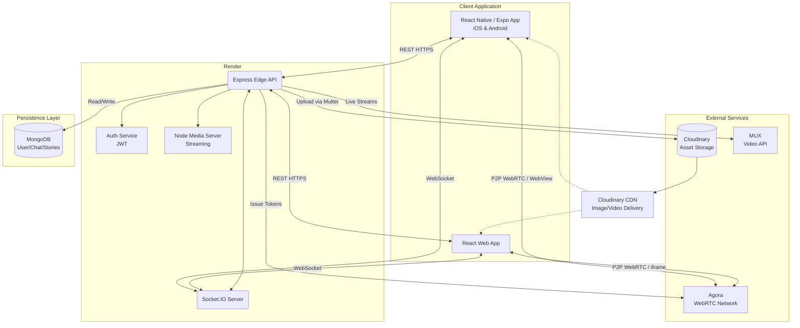

# UNEXA SuperApp System Architecture

## 1. High-Level Overview

UNEXA is a comprehensive SuperApp utilizing a Client-Server architecture. The ecosystem comprises a cross-platform mobile application (built with Expo and React Native) connecting securely to a monolithic auto-scaling backend (Node.js/Express) hosted on Render. 

The architecture supports rich media integration via Cloudinary, real-time messaging through WebSockets (Socket.IO), and high-quality audio/video interactions leveraging Agora WebRTC.

---

## 2. Technology Stack

### 📱 Frontend (Client)
- **Core Framework**: React Native (v0.81.5), Expo (v54), React DOM (for web compatibility)
- **Navigation**: React Navigation (Bottom Tabs, Native Stack)
- **State & Data Fetching**: React State, Axios
- **Real-Time Client**: Socket.IO Client
- **UI Components**: Lucide React Native, Expo Blur, Expo Linear Gradient
- **Device Integrations**: Expo Camera, Image Picker, Document Picker, Av, Local Authentication

### ⚙️ Backend (Server)
- **Server Runtime**: Node.js
- **Web Framework**: Express.js
- **Database ORM**: Mongoose (MongoDB)
- **Authentication**: JWT (JSON Web Tokens), bcryptjs
- **Real-Time Engine**: Socket.IO (WebSockets)
- **Media & Streaming**: Node-Media-Server, Mux, Multer, Cloudinary Integration (Multer-storage-cloudinary)
- **Cloud/External APIs**: Agora (agora-access-token), AWS SDK

### 🌩️ Infrastructure & Deployment
- **Backend Hosting**: Render (Auto-deploy enabled via `render.yaml`)
- **Database Hosting**: MongoDB Atlas (Assumed via Mongoose/Cloud URIs)
- **Mobile Builds**: Expo Application Services (EAS) for Android and iOS
- **Web Hosting**: Vercel/Netlify for exported web builds.

---

## 3. Core Subsystems

### 3.1. Authentication & Security
- **JWT Authentication**: Secure endpoints protected by an authentication middleware. The backend parses `authorization` headers and retrieves User ID context.
- **In-Memory Decryption**: Sensitive query searches (like global user search) parse and filter out data gracefully in-memory, enhancing compliance and user privacy.
- **Rate-Limiting & Headers**: Express Rate Limit and Helmet protect from DDoS vectors and bad actors.

### 3.2. Real-Time Interactions (Messaging)
- **Socket.io Service**: Handles bi-directional persistent connections.
- Enables **Unread Message Tracking**, syncing states continually with the database.
- Support for "Mark as read" flags and dynamic typing indicators.
- **Group Management System**: Handles the lifecycle for group-chats (Create, Add Users, Leave, Roles).

### 3.3. Rich Media & File Management
- **Flow**: User uses device camera ➡️ `expo-image-picker`/`expo-camera` captures the media ➡️ multipart/form-data sent to `api/upload` endpoint.
- **Processing**: The backend leverages `multer` to pipe the file buffer straight to Cloudinary via `multer-storage-cloudinary`.
- **Delivery**: The system saves the resulting Cloudinary CDN-optimized URL inside the database entity and broadcasts the rendered media path back via sockets.

### 3.4. Video & Audio Calling via Agora
- **Communication Flow**: 
  1. Handshake occurs via REST API: Server generates dynamic RTCC tokens using `agora-access-token`.
  2. The mobile front-end utilizes a `react-native-webview` bridge, mounting an iframe-based Agora WebRTC solution. This facilitates maximum compatibility.
  3. Video/Audio tracks are established peer-to-peer.

### 3.5. Story Viewer Analytics
- A list-view metric system storing viewership data metrics. Triggered via the backend endpoint returning structured arrays for read-receipt-like behaviors on media stories.

---

## 4. Architecture Diagram

---

## 5. Deployment Workflow (CI/CD)

The current state of the application involves a fully integrated setup relying on branching deployment protocols:

1. **Source Control**: GitHub tracking changes on the `main` branch.
2. **Backend**: Render listens via webhook integrations, invoking build commands post-push.
3. **Frontend Mobile**: Over-The-Air (OTA) updates triggered dynamically or via `eas build --platform {ios|android}`.
4. **Environment Constraints**: Secrets and production keys mapped exclusively on the host server dashboards (`.env` omitted).
